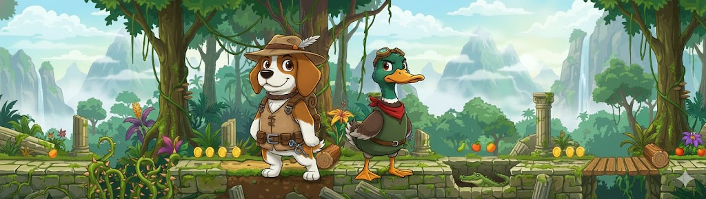

# ⛓️ Tied Together



A real-time multiplayer 2D platformer where two players are connected by a chain and must cooperate to jump through an infinite jungle filled with spike traps and bottomless pits!

## 📋 Prerequisites

Before you begin, ensure you have the following installed:

- **Node.js** (v14 or higher) - [Download here](https://nodejs.org/)
- **npm** (comes with Node.js)

To verify your installation:
```bash
node --version
npm --version
```

## 🚀 Setup Instructions

### Step 1: Clone the Repository

```bash
git clone <repository-url>
cd tied_together
```

Or if you already have the files, just navigate to the project directory:
```bash
cd tied_together
```

### Step 2: Install Dependencies

Install all required packages:

```bash
npm install
```

This will install:
- `express` - Web server framework
- `socket.io` - Real-time multiplayer communication
- `nodemon` (dev dependency) - Auto-restart during development

### Step 3: Start the Server

#### Development Mode (Recommended for testing)

For development with automatic server restart on file changes:

```bash
npm run dev
```

#### Production Mode

For a standard server run:

```bash
npm start
```

The server will start on **port 3000** by default.

### Step 4: Open in Browser

Once the server is running, open your web browser and navigate to:

```
http://localhost:3000
```

You should see the game menu screen.

## 🎮 How to Play

### Creating a Room

1. Click **"Create Room"** on the main menu
2. A room code will be generated (e.g., "ABC123")
3. Share the room code or link with your friend
4. Choose your character (Duck 🦆 or Dog 🐕)
5. Wait for your friend to join and select their character
6. Once both players have selected characters, click **"Start Game"** (only the room creator can start)

### Joining a Room

1. Enter the 6-character room code in the input field
2. Click **"Join Room"**
3. Choose your character (Duck 🦆 or Dog 🐕)
4. Wait for the host to start the game

### Gameplay Controls

- **Move**: Arrow Keys or WASD
- **Jump**: Spacebar, W, or Arrow Up
- **Restart**: Click the "RESTART" button (appears in top-right during game)

### Game Objective

- Jump as far as you can together!
- Stay connected - don't stretch the chain too far
- Avoid spike traps (instant death for anyone)
- Avoid falling into the abyss together (if both fall, game over)
- One player can save the other from falling

## 🌐 Playing on Local Network

To play with friends on the same network:

1. Find your local IP address:
   - **Windows**: Run `ipconfig` in Command Prompt
   - **Mac/Linux**: Run `ifconfig` in Terminal
   - Look for IPv4 address (usually starts with 192.168.x.x)

2. Start the server as usual

3. Have your friend navigate to:
   ```
   http://YOUR_LOCAL_IP:3000
   ```
   Replace `YOUR_LOCAL_IP` with your actual IP address

4. Make sure your firewall allows connections on port 3000

## 🔧 Configuration

### Changing the Server Port

If port 3000 is already in use, you can change it by modifying `server.js`:

```javascript
const PORT = process.env.PORT || 3000; // Change 3000 to your desired port
```

Or set an environment variable:
```bash
PORT=4000 npm start
```

### Game Settings

Game parameters can be adjusted in `public/game.js`:

```javascript
const CONFIG = {
    CANVAS_WIDTH: 1200,
    CANVAS_HEIGHT: 600,
    PLAYER_WIDTH: 60,
    PLAYER_HEIGHT: 75,
    PLAYER_SPEED: 5,
    JUMP_FORCE: 12,
    GRAVITY: 0.5,
    MAX_CHAIN_LENGTH: 150,
    CHAIN_STIFFNESS: 0.3,
    GROUND_Y: 550
};
```

## 🐛 Troubleshooting

### Server Won't Start

**Error: Port 3000 is already in use**
- Solution: Kill the process using port 3000 or change the port (see Configuration above)
- On Windows: `netstat -ano | findstr :3000` then `taskkill /F /PID <PID>`
- On Mac/Linux: `lsof -ti:3000 | xargs kill`

### Players Can't Connect

- ✅ Ensure the server is running (`npm start` or `npm run dev`)
- ✅ Check that both players are using the same URL/port
- ✅ Verify the room code is entered correctly (case-sensitive, 6 characters)
- ✅ Check firewall settings - port 3000 must be accessible
- ✅ For local network play, ensure both devices are on the same Wi-Fi network

### Game Not Loading

- ✅ Open browser console (F12) to check for errors
- ✅ Ensure all assets are in `public/assets/` folder:
  - `backdrop.png`
  - `duck.png`
  - `dog.png`
- ✅ Clear browser cache and refresh

### Character Images Not Showing

- ✅ Verify image files exist in `public/assets/`
- ✅ Check browser console for 404 errors
- ✅ Ensure file names match exactly (case-sensitive)

## 📁 Project Structure

```
tied_together/
├── server.js              # Node.js server with Socket.io
├── package.json           # Dependencies and scripts
├── README.md             # This file
└── public/               # Client-side files
    ├── index.html        # Main HTML structure
    ├── style.css         # Styling (minimalistic pixelated theme)
    ├── game.js           # Game engine, physics, and rendering
    └── assets/           # Game assets
        ├── backdrop.png  # Background image
        ├── duck.png      # Duck character sprite
        └── dog.png       # Dog character sprite
```

## 🛠️ Technology Stack

- **Backend**: Node.js, Express, Socket.io
- **Frontend**: HTML5 Canvas, Vanilla JavaScript, CSS3
- **Real-time**: WebSocket communication via Socket.io

## 🚢 Deployment

### Local Development
The game runs locally with `npm run dev` or `npm start`.

### Deploying to Render

[Render](https://render.com) is a great free hosting option for Node.js applications. Here's how to deploy:

#### Prerequisites
1. A GitHub account
2. Your code pushed to a GitHub repository
3. A Render account (sign up at [render.com](https://render.com))

#### Step-by-Step Deployment

**Step 1: Push to GitHub**
```bash
git init
git add .
git commit -m "Initial commit"
git remote add origin https://github.com/YOUR_USERNAME/tied_together.git
git push -u origin main
```

**Step 2: Create a New Web Service on Render**

1. Log in to [Render Dashboard](https://dashboard.render.com)
2. Click **"New +"** → **"Web Service"**
3. Connect your GitHub account if not already connected
4. Select your `tied_together` repository

**Step 3: Configure the Service**

Fill in the following settings:

- **Name**: `tied-together` (or any name you prefer)
- **Environment**: `Node`
- **Region**: Choose closest to you
- **Branch**: `main` (or `master` if that's your default branch)
- **Root Directory**: Leave empty (or `.` if you want to be explicit)
- **Build Command**: `npm install`
- **Start Command**: `npm start`
- **Instance Type**: 
  - **Free tier**: Choose "Free" (has limitations but works for testing)
  - **Paid tier**: Choose "Starter" or higher for better performance

**Step 4: Advanced Settings (Optional)**

Click "Advanced" to configure:

- **Auto-Deploy**: `Yes` (automatically deploys on git push)
- **Health Check Path**: Leave empty or set to `/`
- **Environment Variables**: Not needed (PORT is set automatically)

**Step 5: Deploy**

1. Click **"Create Web Service"**
2. Render will automatically:
   - Clone your repository
   - Run `npm install`
   - Start the server with `npm start`
3. Wait for the build to complete (usually 2-5 minutes)
4. Your app will be live at: `https://tied-together.onrender.com` (or your custom name)

**Step 6: Access Your Game**

Once deployed, you'll get a URL like:
```
https://tied-together.onrender.com
```

Share this URL with friends to play together!

#### Important Notes for Render

- **Free Tier Limitations**:
  - Services spin down after 15 minutes of inactivity
  - First request after spin-down takes ~30 seconds to wake up
  - For production use, consider the paid tier ($7/month)

- **WebSocket Support**: 
  - Render fully supports WebSocket connections (Socket.io works perfectly)
  - No additional configuration needed

- **Environment Variables**:
  - `PORT` is automatically set by Render (don't override it)
  - Your `server.js` already uses `process.env.PORT || 3000` ✅

- **Auto-Deploy**:
  - Every push to your main branch will trigger a new deployment
  - You can disable this in the service settings if needed

#### Updating Your Deployment

After making changes:
```bash
git add .
git commit -m "Your changes"
git push origin main
```

Render will automatically detect the push and redeploy your service.

### Other Deployment Options

**Heroku**:
```bash
heroku create tied-together-game
git push heroku main
heroku open
```

**DigitalOcean App Platform**:
- Similar to Render, connect GitHub repo and configure Node.js service

**AWS/Google Cloud**:
- Requires more setup but offers more control and scalability

## 📝 License

MIT License - feel free to use and modify!

## 🎉 Enjoy!

Have fun playing Tied Together with your friends! Jump as far as you can! 🎮⛓️
